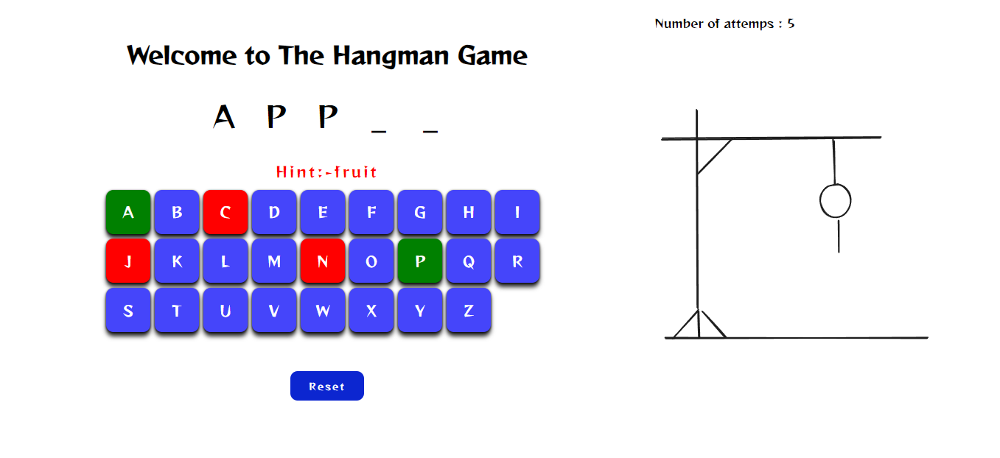
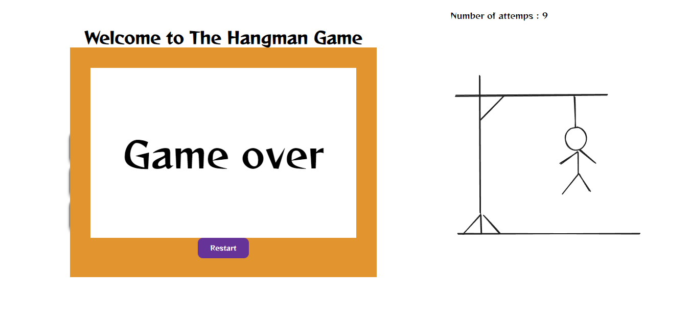

# Hangman Game

This is a simple hangman game built using React. The game allows players to guess letters to uncover a hidden word. 

## Demo
- [Click here](https://66b59dfca1159ff0be7896de--astounding-monstera-5ee069.netlify.app/)
## Screenshots

Here are some screenshots of the hangman game:

Feel free to explore the game and have fun!

## Installation

1. Clone the repository: `git clone https://github.com/your-username/hangman-game.git`
2. Navigate to the project directory: `cd hangman-game`
3. Install dependencies: `npm install`

## Usage

1. Start the game: `npm run dev`
2. Guess letters to uncover the hidden word
3. Keep guessing until you either guess the word correctly

## Contributing

Contributions are welcome! If you find any bugs or have suggestions for improvements, please open an issue or submit a pull request.
